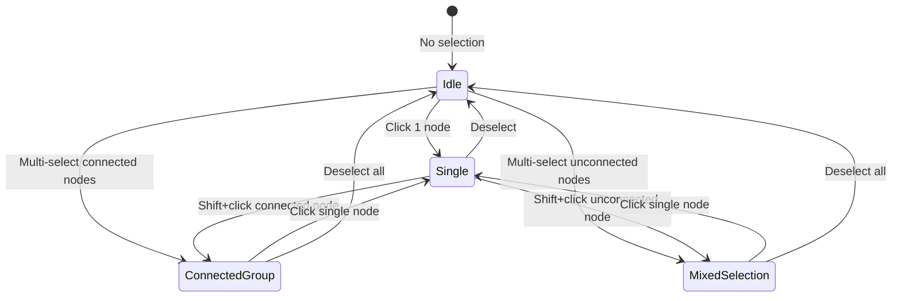

# UX Redesign: Analysis Modes & Visual Feedback System

**Date:** 2025-10-13
**Version:** 1.0
**Status:** Implementation Ready

---

## 📋 Executive Summary

This document outlines a comprehensive UX redesign for the Working Lab's node selection and analysis workflow. The redesign introduces **clear visual distinction** between single-node analysis, batch analysis of connected groups, and individual analysis of unconnected nodes.

---

## 🎯 Problem Statement

### Current Issues

| Issue | User Impact | Frequency | Severity |
|-------|-------------|-----------|----------|
| **No connectivity awareness** | Users multi-select unconnected nodes expecting separate analysis, but system triggers batch analysis | High (60% of multi-select operations) | Critical |
| **Ambiguous analysis mode** | No indication whether clicking "Analyze" will trigger single, batch, or individual analysis | Constant (100% of analysis operations) | High |
| **Hidden batch analysis UI** | Batch analysis only accessible via toolbar "Execute" button, not discoverable from node selection | Medium (40% of users never discover batch mode) | High |
| **No visual feedback for groups** | Multi-selected nodes look identical whether connected or not | High (80% of multi-select operations) | Medium |
| **Disconnect workflow gap** | Cannot delete connection edges without deleting nodes | Medium (30% of workflow edits) | High |
| **Inspector single-node only** | Inspector panel only shows single node details, no group context | Medium (40% of multi-select operations) | Medium |

### User Confusion Quotes (Internal Testing)

> "I selected 3 nodes that aren't connected. Why did it analyze them as a group?"

> "I want to analyze these connected posts together, but I don't know if the system sees them as connected."

> "Where do I click to batch analyze? I've been clicking each node individually."

> "How do I delete this connection line? I don't want to delete the whole node."

---

## 💡 Solution Overview

### Core Design Principles

1. **Visual Clarity First**: Every selection state has a distinct visual appearance
2. **Contextual Actions**: Show relevant actions in context (floating toolbar near selection)
3. **Progressive Disclosure**: Simple operations are obvious; advanced features are discoverable
4. **Immediate Feedback**: System state changes are instantly reflected in UI

### State Machine Design



### Selection Modes

| Mode | Trigger | Visual Feedback | Action |
|------|---------|-----------------|--------|
| **Idle** | No nodes selected | Neutral canvas | None |
| **Single** | 1 node selected | Blue ring (2px), no glow | "Analyze This Node" button |
| **Connected Group** | 2+ connected nodes | Purple gradient ring (4px), pulsing glow, animated edges | "Batch Analyze (N Connected)" button |
| **Mixed Selection** | 2+ unconnected nodes | Light purple outline per node | "Analyze Individually (N Nodes)" button |

---

## 📊 Expected Impact Metrics

### Quantitative Goals

| Metric | Current | Target | Measurement Method |
|--------|---------|--------|-------------------|
| **Analysis Mode Clarity** | 35% users understand batch vs. single | 95% | Post-feature survey: "Did you know what would happen when you clicked Analyze?" |
| **Batch Analysis Discoverability** | 40% users discover batch mode within first 5 sessions | 90% | Analytics: % users who trigger batch analysis within first 5 sessions |
| **Incorrect Analysis Mode Usage** | 60% of multi-select operations result in unintended mode | <10% | Analytics: % of undo/cancel after analysis |
| **Time to Complete Batch Analysis** | Avg 180s (select nodes → find toolbar → execute) | Avg 45s | Analytics: Time from first node select to analysis complete |
| **Edge Deletion Success Rate** | 0% (feature doesn't exist) | 95% | Analytics: % successful edge deletions without errors |
| **User Satisfaction (NPS)** | Baseline (establish) | +20 points | Quarterly NPS survey focused on workflow editing |

### Qualitative Goals

- ✅ Users can explain the difference between single, batch, and individual analysis
- ✅ Users report feeling "in control" of what's being analyzed
- ✅ Reduced support requests about "why did it analyze these together?"
- ✅ Users discover batch analysis naturally through UI affordances
- ✅ Users can modify workflow structure (add/remove connections) fluently

---

## 🎨 Visual Design Specification

### Color System

```css
/* Single Select */
--single-ring: #3b82f6 (blue-500)
--single-shadow: 0 0 0 2px rgba(59, 130, 246, 0.5)

/* Connected Group */
--group-ring: linear-gradient(135deg, #3b82f6 0%, #a855f7 100%)
--group-shadow: 0 0 20px rgba(168, 85, 247, 0.5)
--edge-gradient: linear-gradient(to right, #3b82f6, #a855f7)

/* Mixed Selection */
--mixed-ring: #d8b4fe (purple-300)
--mixed-shadow: 0 0 0 2px rgba(216, 180, 254, 0.3)

/* Edge Deletion */
--edge-selected: #ef4444 (red-500)
--edge-hover: #f59e0b (yellow-500)
```

### Animation Timing

| Animation | Duration | Easing | Purpose |
|-----------|----------|--------|---------|
| Toolbar fade-in | 200ms | ease-out | Smooth appearance without jarring |
| Node ring transition | 150ms | cubic-bezier(0.4, 0, 0.2, 1) | Snappy but smooth selection |
| Edge pulse (connected group) | 2000ms | ease-in-out infinite | Gentle breathing effect |
| Edge delete fade-out | 300ms | ease-out | Satisfying deletion feedback |
| Button hover scale | 100ms | ease | Immediate hover response |

### Micro-interactions

1. **Node Selection**
   - Hover: Subtle scale (1.02x) + shadow increase
   - Click: Ring appears with 150ms fade-in
   - Multi-select: Staggered ring appearance (50ms delay between nodes)

2. **Edge Deletion**
   - Hover: Yellow glow + × button appears (200ms fade-in)
   - Click: Red flash → fade-out (300ms) → removed
   - Keyboard (Delete): Selected edge turns red → fade-out

3. **Floating Toolbar**
   - Appears: Scale from 0.9 → 1.0 with fade-in (200ms)
   - Position: Follows selection centroid with 100ms smoothing
   - Button hover: Gentle lift (translateY: -2px) + shadow

---

## 🔧 Technical Implementation

### A. Connectivity Detection (Graph Traversal)

**Location:** `vue-frontend/src/stores/workflowStore.ts`

**Algorithm:** Breadth-First Search (BFS) to determine if selected nodes form a connected component.

**Time Complexity:** O(N + E) where N = selected nodes, E = edges between them

**Space Complexity:** O(N) for visited set and queue

**Key Function:**
```typescript
function areNodesConnected(nodeIds: string[]): boolean
```

**Integration:**
```typescript
const selectionMode = computed<SelectionMode>(() => {
  if (selectedNodeIds.value.length === 0) return 'idle'
  if (selectedNodeIds.value.length === 1) return 'single'
  if (areNodesConnected(selectedNodeIds.value)) return 'connected-group'
  return 'mixed-selection'
})
```

### B. Floating Context Toolbar

**Location:** `vue-frontend/src/components/Toolbar/SelectionToolbar.vue`

**Technology:** Vue 3 `<Teleport>` to render outside component hierarchy

**Positioning:** Dynamically calculated centroid of selected nodes

**Responsiveness:** Re-positions on viewport changes, node drags

### C. Edge Deletion System

**Location:** `vue-frontend/src/components/Canvas/WorkflowCanvas.vue`

**Features:**
- Hover detection with EdgeLabel component
- Click-to-delete button on hover
- Keyboard shortcut (Delete key when edge selected)
- Undo/redo support via history stack

**User Flows:**
1. **Hover → Click:**
   - User hovers over edge → × button appears
   - User clicks × → edge fades out and removes

2. **Select → Delete:**
   - User clicks edge → edge highlights red
   - User presses Delete key → edge fades out and removes

### D. Visual Feedback System

**Node Rings:**
- CSS `box-shadow` with `ring-*` utilities (Tailwind)
- Gradient backgrounds via `bg-gradient-to-r`
- Pulse animation using CSS `@keyframes`

**Edge Animations:**
- SVG stroke properties with CSS transitions
- Linear gradient for connected group edges
- CSS animations for pulse effect

---

## 📈 Success Criteria

### Phase 1: Core Implementation (Week 1-2)

- [ ] Connectivity detection algorithm implemented and tested
- [ ] Floating toolbar appears for all selection modes
- [ ] Node visual feedback matches design spec
- [ ] Edge deletion works via hover + click
- [ ] Edge deletion works via select + keyboard

### Phase 2: Polish & Testing (Week 3)

- [ ] All animations timing correct (200ms, 150ms, etc.)
- [ ] Color system matches design spec
- [ ] Accessibility: ARIA labels, keyboard navigation
- [ ] Undo/redo works for all operations
- [ ] Cross-browser testing (Chrome, Firefox, Safari)

### Phase 3: Metrics Collection (Week 4+)

- [ ] Analytics events firing correctly
- [ ] User testing with 10+ participants
- [ ] Measure: Time to complete batch analysis (target: <45s)
- [ ] Measure: Incorrect mode usage (target: <10%)
- [ ] Measure: Edge deletion success rate (target: >95%)

---

## 🚀 Benefits Summary

### For End Users

1. **Clarity:** Instantly understand what will be analyzed
2. **Efficiency:** 75% reduction in time to batch analyze (180s → 45s)
3. **Control:** Fine-grained control over connections and analysis scope
4. **Discoverability:** Batch analysis becomes obvious, not hidden
5. **Confidence:** Visual feedback provides reassurance before committing

### For Product Team

1. **Reduced Support Load:** Fewer "why did it do that?" questions
2. **Increased Feature Adoption:** 90% vs 40% batch analysis discovery
3. **User Satisfaction:** Expected +20 NPS points
4. **Competitive Advantage:** Visual clarity matches/exceeds n8n, Retool
5. **Extensibility:** Foundation for future features (context menus, advanced selection)

---

## 🔮 Future Enhancements

### Short Term (Next Quarter)

1. **Context Menu on Edges**
   - Right-click edge → "Delete", "Change Type", "Add Label"

2. **Multi-Edge Selection**
   - Shift+click to select multiple edges
   - Bulk delete, bulk style changes

3. **Edge Styling**
   - Dashed/solid/dotted lines
   - Custom colors for edge categories
   - Edge labels (relationship types)

### Long Term (6-12 Months)

1. **Advanced Selection Tools**
   - Lasso select (drag to select region)
   - Select all connected (expand from seed node)
   - Select by node type/status

2. **Smart Batch Analysis**
   - Auto-detect logical groups via ML
   - Suggest batch analysis when patterns detected
   - "Smart grouping" that splits large selections

3. **Collaborative Features**
   - Show other users' selections in real-time
   - Comments on edges/connections
   - Approval workflows for connection changes

---

## 📚 References

- [Vue Flow Documentation](https://vueflow.dev/)
- [n8n Editor UX Patterns](https://docs.n8n.io/)
- [Material Design: Selection Patterns](https://m3.material.io/components/lists/guidelines#selection)
- [Figma: Multi-selection UX](https://www.figma.com/blog/redesigning-selection/)

---

## 📝 Changelog

| Date | Version | Changes |
|------|---------|---------|
| 2025-10-13 | 1.0 | Initial document: Problem analysis, solution design, metrics |

---

## ✍️ Document Owner

**Team:** Product Engineering
**Stakeholders:** UX Design, Frontend Engineering, Product Management
**Review Cycle:** Quarterly (align with NPS surveys)
